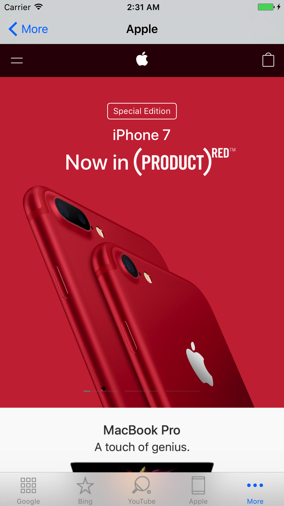

# TabBarControllerMSB
TabBarController using multiple storyboards
---
This project demonstrates implementing TabBarController using multiple storyboards to ease development. 
Each Tab uses a separate storyboard enabling easier and safer development. 
The technique can also mix storyboards and pure code view controller.

This technique is a solution to the [Convoluted Monolithinc Complex Storyboard problem](https://www.quora.com/Which-is-better-for-iOS-apps-storyboards-or-programmatic-development) when targeting iOS 8 and below.

If your app is targeting iOS 9 and above, you could use [Storyboard references](https://www.raywenderlich.com/115697/ios-9-storyboards-tutorial-whats-new-in-storyboards)
---
##  The germane sections 
Arrays of images and titles in the app delegate
```swift
 let arrayOfImages = [ "1", "2", "3", "4", "5", "6", "7"]
    let arrayOfTitles = [ "Google", "Bing", "YouTube", "Apple", "Github", "Wikipedia", "GoogleNews"]
```
Creating view controllers from storyboards
```swift
     func getArrayOfViewControllers() -> [ViewController] {
        
        let googleVC = UIStoryboard.init(name: "Google", bundle: Bundle.main).instantiateInitialViewController()
        let bingVC = UIStoryboard.init(name: "Bing", bundle: Bundle.main).instantiateInitialViewController()
        let gooogleNewsVC = UIStoryboard.init(name: "GoogleNews", bundle: Bundle.main).instantiateInitialViewController()
        let youtubeVC = UIStoryboard.init(name: "YouTube", bundle: Bundle.main).instantiateInitialViewController()
        let wikipediaVC = UIStoryboard.init(name: "Wikipedia", bundle: Bundle.main).instantiateInitialViewController()
        let appleVC = UIStoryboard.init(name: "Apple", bundle: Bundle.main).instantiateInitialViewController()
        let githubVC = UIStoryboard.init(name: "Github", bundle: Bundle.main).instantiateInitialViewController()
        
        let arrayOfVC:[UIViewController] = [googleVC!, bingVC!,gooogleNewsVC!,
                                            youtubeVC!,wikipediaVC!, appleVC!, githubVC!]
        
        return arrayOfVC as! [ViewController]
        
    }
```
setting up the tabbarcontroller when the app starts
```swift
   func application(_ application: UIApplication, didFinishLaunchingWithOptions launchOptions: [UIApplicationLaunchOptionsKey: Any]?) -> Bool {
        // Override point for customization after application launch.
        
        let tabBar = UITabBarController()
        tabBar.viewControllers = self.getArrayOfViewControllers()
        self.customiseTabItems(tabBar: tabBar.tabBar)
        // set tabBar as root
        
        self.window?.rootViewController = tabBar
        self.window?.makeKeyAndVisible()
        return true
    }
```





